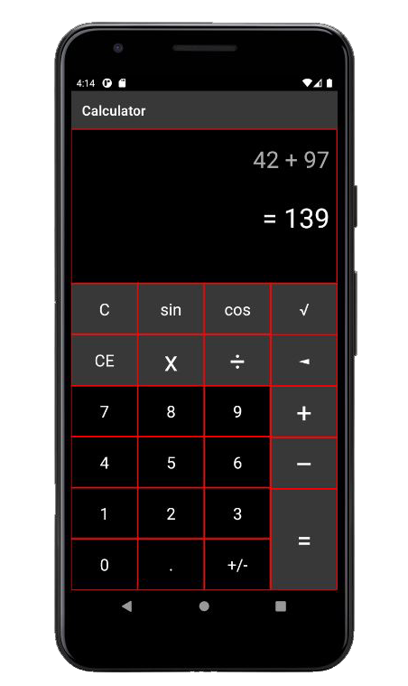
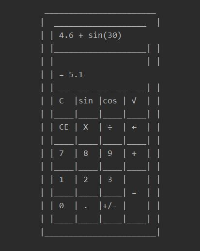
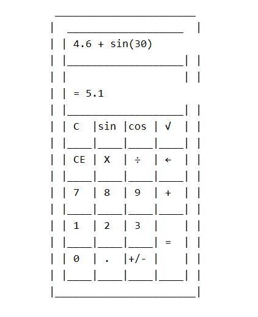
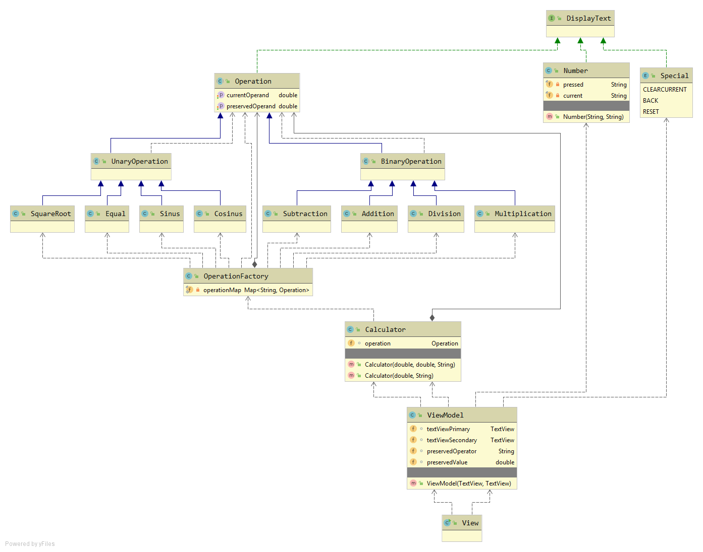

# JavaOOPCalculator

Java Console Calculator with unary, binary functions and special operations. Factory Pattern allows any developer to add their own arithmetic operations as objects, without affecting the main code. This Project is platform for my future Android Calculator application.
 

</img>

 

## Design Patterns

- Model View ViewModel (MVVM)
- Factory Pattern

## Contents

- Interface
- Abstract Classes
- Enums

## Console View
 

</img></img>

 

## Dependencies
 

</img>

 

___🔃 Last updated : 25 Apr 2021___
